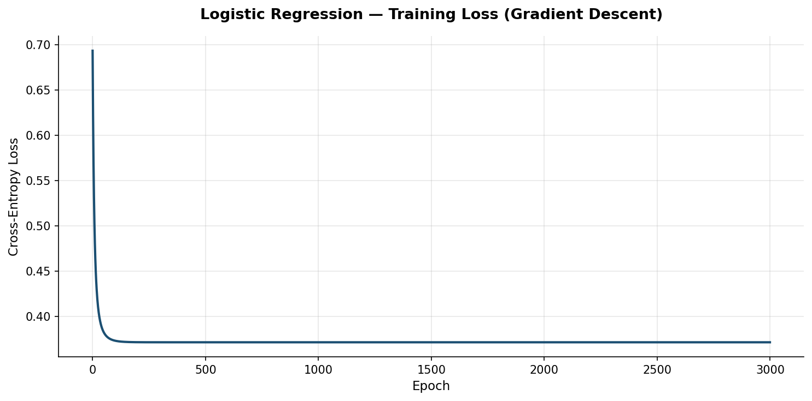
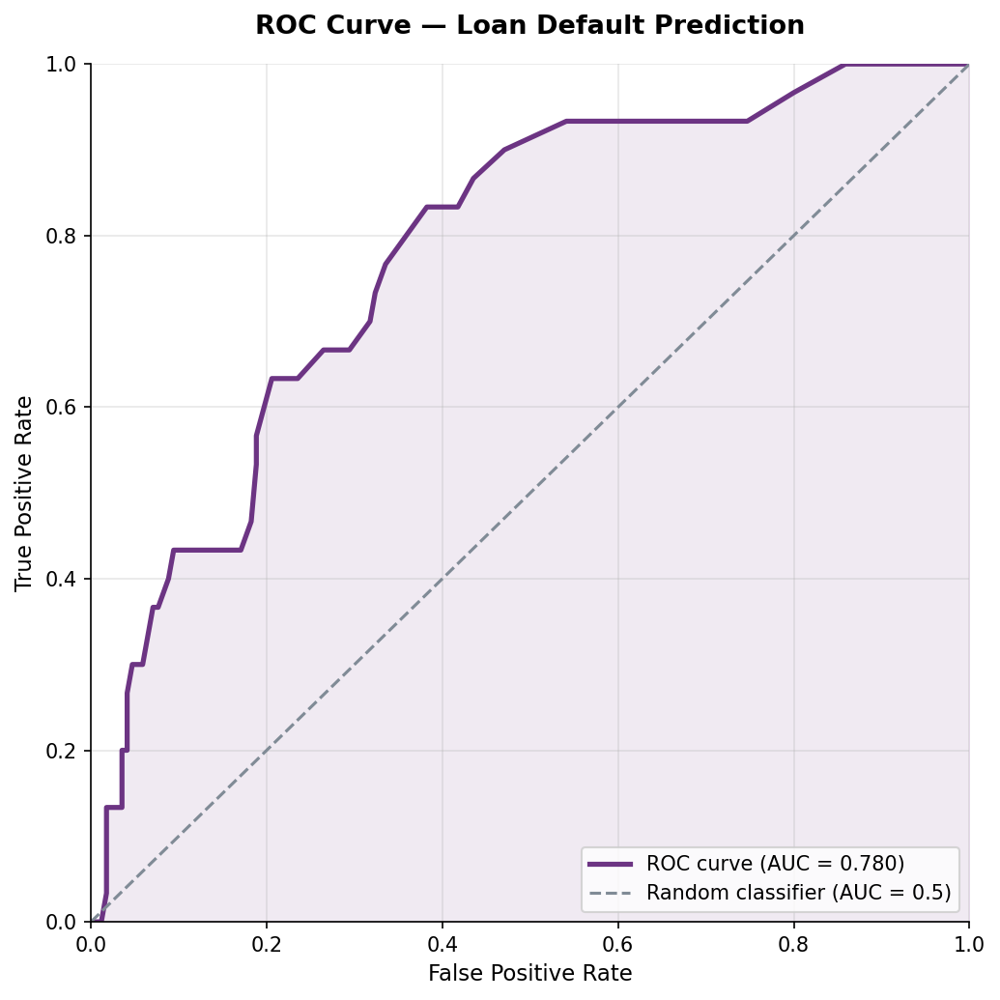
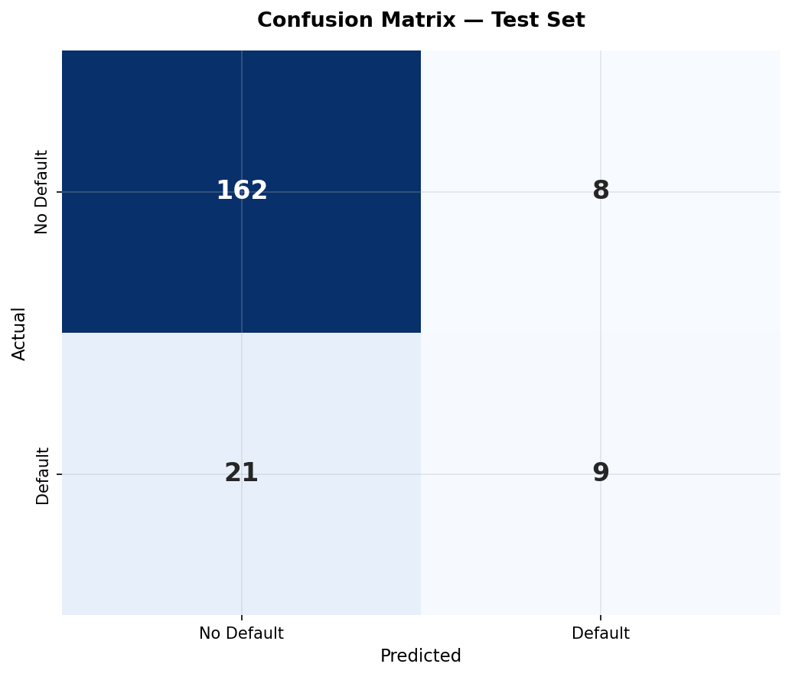
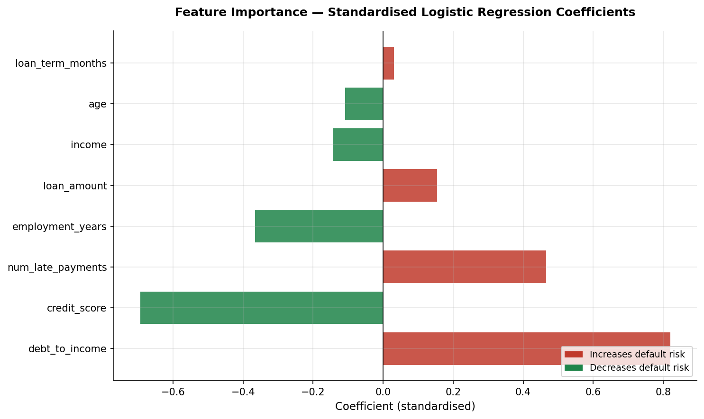
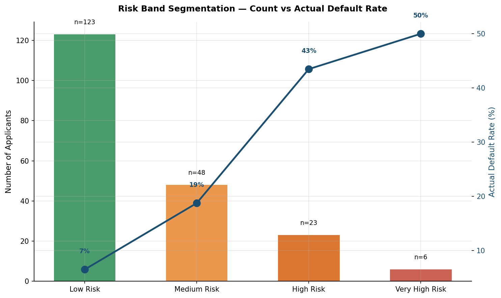
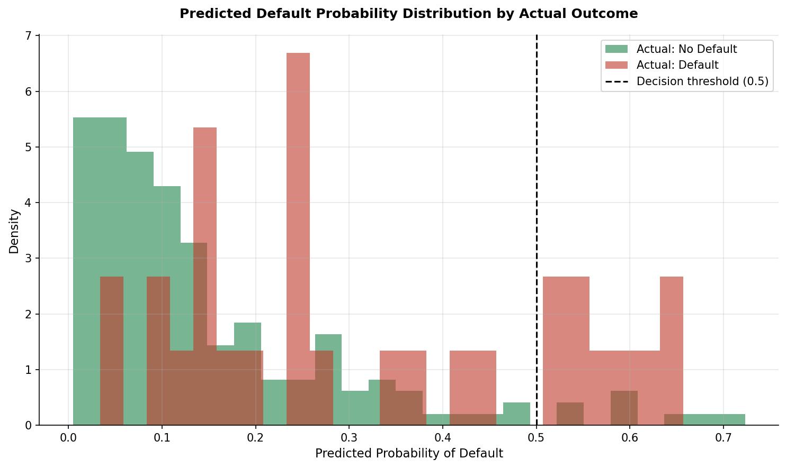

# 💳 Loan Default Risk Prediction Model

> **Author:** Shareef Chitesi  
> **Degree:** BSc Honours in Applied Mathematics and Computational Science  
> **Institution:** Midlands State University — Year 2  
> **Tools:** Python · NumPy · Pandas · Matplotlib · Seaborn · Power BI  

---

## Why I Built This

Every loan a bank approves is a bet on the future. Get the risk assessment wrong too often in one direction and you lose money to defaults; get it wrong in the other direction and you turn away good customers. I wanted to understand how that decision is actually made mathematically — not just read about logistic regression in a textbook, but build the whole thing myself: the model, the training algorithm, and the evaluation framework a real credit risk team would use.

This project implements a full loan default prediction model from first principles using NumPy — no scikit-learn, no black box. Every gradient descent step, every probability calculation, and every evaluation metric is coded by hand using the same mathematics covered in my Probability Theory, Applied Statistics, and Linear Algebra modules.

---

## 📊 Results

| Metric | Value |
|--------|-------|
| Dataset size | 1,000 loan applicants |
| Default rate | 16.6% |
| Model | Logistic Regression (gradient descent, from scratch) |
| **Accuracy** | **85.5%** |
| **AUC (ROC)** | **0.780** |
| Precision | 52.9% |
| Recall | 30.0% |
| F1 Score | 0.383 |

An AUC of 0.78 indicates a genuinely useful model — well above the 0.5 baseline of random guessing, and in a range that real-world credit scoring models often operate within when working with a similar number of features.

---

## 🎯 What Drives Default Risk

The model identified clear, interpretable risk drivers — and importantly, they make economic sense, which is exactly what a risk team would want to see:

| Feature | Effect | Direction |
|---------|--------|-----------|
| **Debt-to-income ratio** | Strongest predictor | ↑ Increases risk |
| **Credit score** | Second strongest | ↓ Decreases risk |
| **Number of late payments** | Strong predictor | ↑ Increases risk |
| **Employment years** | Moderate predictor | ↓ Decreases risk |
| Loan amount | Weak predictor | ↑ Increases risk |
| Income | Weak predictor | ↓ Decreases risk |
| Age | Weak predictor | ↓ Decreases risk |
| Loan term | Negligible | ↑ Slightly increases risk |

This matches real-world credit risk intuition: how much of your income is already committed to debt, and your track record of paying on time, matter far more than how much you earn in absolute terms.

---

## 🚦 Risk Segmentation — The Model Actually Works

The real test of a risk model isn't just accuracy — it's whether the risk bands it creates are meaningful. Here, they are:

| Risk Band | Applicants | Actual Default Rate |
|-----------|-----------|---------------------|
| Low Risk | 123 | 6.5% |
| Medium Risk | 48 | 18.8% |
| High Risk | 23 | 43.5% |
| Very High Risk | 6 | 50.0% |

The default rate climbs cleanly and monotonically from 6.5% to 50% as the model's risk score increases. This is exactly the kind of consistent, defensible segmentation a bank's risk department needs to set pricing, loan limits, or approval thresholds.

---

## 📈 Visualisations

### 1. Training Loss Curve
Shows the gradient descent algorithm converging — confirms the model trained correctly.


### 2. ROC Curve
AUC of 0.780, well above the random baseline of 0.5.


### 3. Confusion Matrix


### 4. Feature Importance
Which factors actually drive default risk, and in which direction.


### 5. Risk Band Segmentation
Visual proof that the model's risk bands correspond to real differences in default behaviour.


### 6. Predicted Probability Distribution
How well the model separates defaulters from non-defaulters.


---

## 📐 Methodology — Built From Scratch

### The Model
Logistic regression estimates the probability of default using:

```
p = 1 / (1 + e^(-z)),   where z = β₀ + β₁x₁ + β₂x₂ + ... + βₙxₙ
```

### Training — Gradient Descent on Cross-Entropy Loss
Rather than using a library's `.fit()` method, I implemented the full training loop:

```
Loss = -mean[ y·log(p) + (1-y)·log(1-p) ] + L2 penalty
Gradient = Xᵀ(p - y) / n
β ← β - learning_rate × Gradient
```

This is the same Maximum Likelihood Estimation principle covered in Probability Theory — just applied iteratively instead of solved analytically, since logistic regression has no closed-form solution.

### Evaluation — All Metrics Coded Manually
- **Confusion matrix** — built from raw predictions vs actuals
- **ROC curve** — generated by sweeping 100 decision thresholds and computing TPR/FPR at each
- **AUC** — calculated via the trapezoidal rule, `np.trapezoid(tpr, fpr)`

### Data
This project uses a synthetic but realistically distributed loan dataset (1,000 applicants) with features common to real credit applications: age, income, loan amount, credit score, employment history, debt-to-income ratio, late payment history, and loan term. The underlying default probability was generated using a known risk function with added noise, allowing the model's recovered coefficients to be checked against ground truth.

---

## 🗂️ Repository Structure

```
loan-default-risk-model/
│
├── risk_model.py                  # Main script — model, training, evaluation
│
├── data/
│   └── loan_risk_data.xlsx        # 4 sheets: Test Predictions, Feature
│                                  # Importance, Risk Segmentation, Model Metrics
│                                  # (Import directly into Power BI)
│
├── outputs/
│   ├── loan_01_training_loss.png
│   ├── loan_02_roc_curve.png
│   ├── loan_03_confusion_matrix.png
│   ├── loan_04_feature_importance.png
│   ├── loan_05_risk_segmentation.png
│   └── loan_06_probability_distribution.png
│
└── README.md
```

---

## ⚙️ How to Run

```bash
pip install numpy pandas matplotlib seaborn openpyxl
python risk_model.py
```

No scikit-learn or statsmodels required — the entire model is built from NumPy.

---

## Honest Limitations

- This uses synthetic data generated from a known risk function, not a real bank's loan book. Real-world data would have messier relationships, missing values, and class imbalance issues that would need careful handling.
- Recall (30%) is lower than ideal — the model misses 70% of actual defaulters at the standard 0.5 threshold. In a real risk setting, this threshold would be tuned based on the bank's risk appetite and the relative cost of false positives vs false negatives.
- A production model would also need to handle correlated features, check for multicollinearity, and be validated against out-of-time data, not just a random train/test split.

---

## 🔮 What's Next

- [ ] Tune the decision threshold to optimise for recall given a target false-positive rate
- [ ] Add interaction terms (e.g. debt-to-income × credit score)
- [ ] Build a comparison against a simple decision tree
- [ ] Build an interactive Power BI dashboard for risk monitoring
- [ ] Test on real anonymised lending data (e.g. LendingClub public dataset)

---

## 💬 Why This Matters

Credit risk modelling sits at the core of banking and lending — every loan decision is, at its heart, a probability estimate. Insurance pricing, mortgage approval, and credit card limits all rely on the same underlying mathematics demonstrated here. This project is my way of showing that I don't just understand the theory behind risk modelling — I can build it, validate it, and explain exactly what it tells you and what it doesn't.

---

## 📬 Get in Touch

**Shareef Chitesi**  
📧 chitesishareef46@gmail.com  
📞 +263782729397  
🎓 BSc Applied Mathematics & Computational Science — Midlands State University
